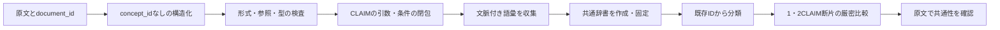

# CLAIMから共通概念辞書を作る構造比較実験

構造化と概念正規化を分ける方式を、仮想ノウハウ56件で試しました。**整った構造化グラフに対する後工程の統制実験では有望です。原文からのLLM自動抽出精度は未検証です。**

指定した一致候補19組は、表現の文字列による比較で1組、初版辞書で18組、改訂辞書で19組を検出しました。区別すべき24組は改訂辞書ですべて区別できました。ただし別枠の診断では、OTHERによる誤一致と、NOT／polarityの表現差による不一致が残っています。

- [実験レポート](docs/experiment_report.md)：実測値、全繰り返しパターン、失敗例、次に調べること
- [仮想ノウハウ56件](docs/corpus.md)
- [プロンプト](prompts/)：構造化・辞書作成・固定辞書による分類・辞書改訂・原文レビュー
- [設計と入力契約](docs/design.md)
- [旧実装との差分と実験の来歴](docs/provenance.md)



## 検証の範囲

原文・構造化注釈・辞書・割当・期待ペアは同じAIアシスタントが作成しました。外部LLM API呼び出しは0回で、独立した抽出プロンプト試験ではありません。構造のテンプレートや共通のmeaning文が正規化を容易にしています。D01〜D24を辞書作成用、D25〜D46を追加事例、D47〜D56を診断例に分けていますが、ブラインドholdoutではありません。

実際にプログラムを実行したのは、形式検査、語彙収集、保存済み割当の検査と適用、厳密比較、集計、採点です。保存済みデータで32テストを実行し、同型判定は独立した全順列判定との100組の照合も行っています。

## 再実行

Python 3.10以降、標準ライブラリだけで動作します。リポジトリ直下で実行します。

```shell
python -X utf8 scripts/run_experiment.py
python -X utf8 scripts/run_tests.py
python -X utf8 scripts/write_report.py
```

`run_experiment.py`は`results/`の保存結果を上書きします。通常は上の実行だけで十分です。指定済みの人工注釈・割当も再生成する場合だけ、次を先に実行します。

```shell
python -X utf8 scripts/build_fixture.py
python -X utf8 scripts/freeze_annotations.py
```

これらは保存した注釈判断の再生用です。任意の原文を自動構造化するコマンドではなく、`data/`の人工データを上書きします。

## 別のデータを比較する

原文台帳は`[{"document_id":"...","text":"...","split":"..."}]`、rawグラフは指定形式の文書グラフの配列です。必要な工程で対応する`prompts/`を使って別途モデルからJSONを取得してください。本実装にはモデルAPI呼び出し機能や認証情報は含みません。

```shell
python -m src.cli validate my-graphs.json --corpus my-corpus.json
python -m src.cli collect my-graphs.json --corpus my-corpus.json --output my-vocabulary.json
```

辞書を作成・固定し、文脈付き語彙と辞書をモデルへ渡して割当JSONを取得した後：

```shell
python -m src.cli normalize my-graphs.json --corpus my-corpus.json --dictionary my-dictionary.json --vocabulary my-vocabulary.json --assignments my-assignments.json --output my-normalized.json
python -m src.cli mine my-normalized.json --corpus my-corpus.json --dictionary my-dictionary.json --output my-patterns.json
```

辞書・語彙ハッシュは`src.pipeline.digest`で計算した値を分類リクエストへ渡します。形式例は`data/assignments.v1.json`を参照してください。未登録IDや割当漏れはエラー、concept_idがnullの断片は保留です。

## 保存ファイル

| 場所 | 内容 |
|---|---|
| `data/corpus.json` / `graphs.raw.json` | 原文と概念IDなしのグラフ |
| `data/vocabulary*.json` | 重複を除いた文脈付き語彙と辞書作成用の部分集合 |
| `data/dictionary.v1.json` / `dictionary.v2.json` | 固定ID・名称・定義・該当例・境界を持つ13概念／14概念の辞書 |
| `data/classification_decisions.v1.json` | アシスタントが選んだ分類判断の記録 |
| `data/assignments.v*.json` / `graphs.normalized.v*.json` | 辞書版とハッシュに結びつけた割当と正規化結果 |
| `data/evaluation_pairs.json` | 43統制ペアと4診断ペア。探索器から分離 |
| `results/strict_v2.json` | 全パターン、原文、ノード・接続対応表、支持文書数・出現数 |
| `results/evaluation.json` | 全方式のペアごとの一致／不一致／保留 |
| `results/concept_usage.json` / `unassigned.v1.json` | 概念の使用状況と未登録例 |
| `results/revision.json` / `normalization_effect.json` | 辞書改訂と正規化による統合の記録 |
| `results/validation.json` / `run_manifest.json` / `test_run.json` | 検査結果、入力・コードのハッシュ、実行環境、テスト結果 |

`results/strict_v2.json`の13個の繰り返しパターンは独立した13原理ではありません。上位・下位断片が重複し、OTHERの誤一致も含みます。原文の確認が必要です。
